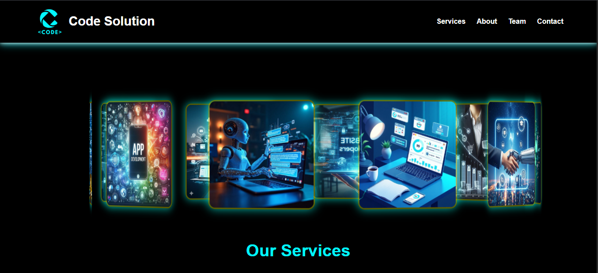
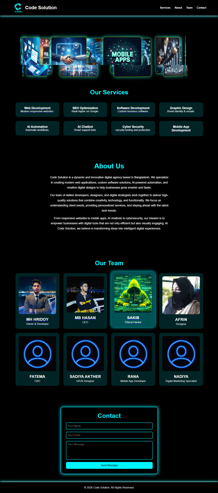
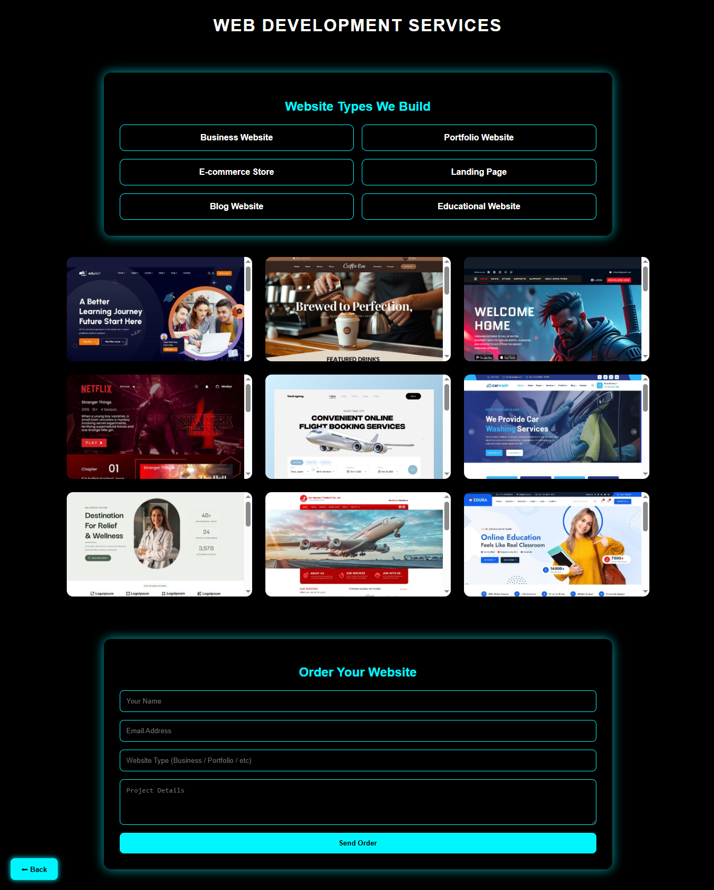
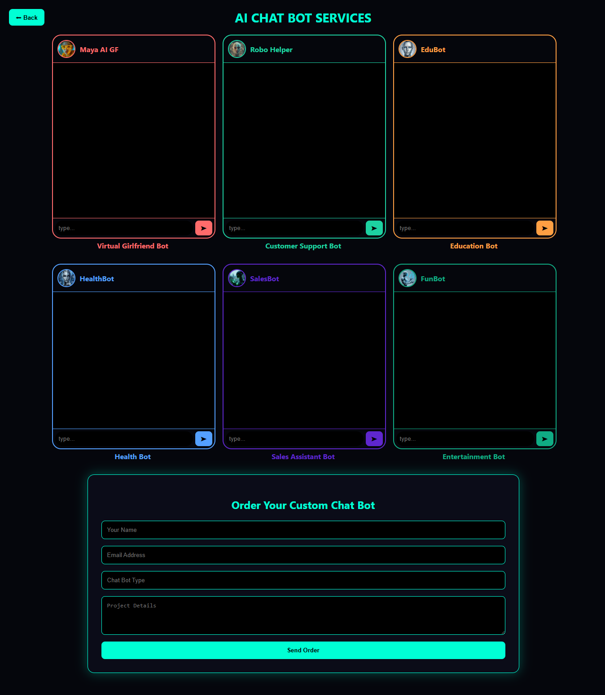
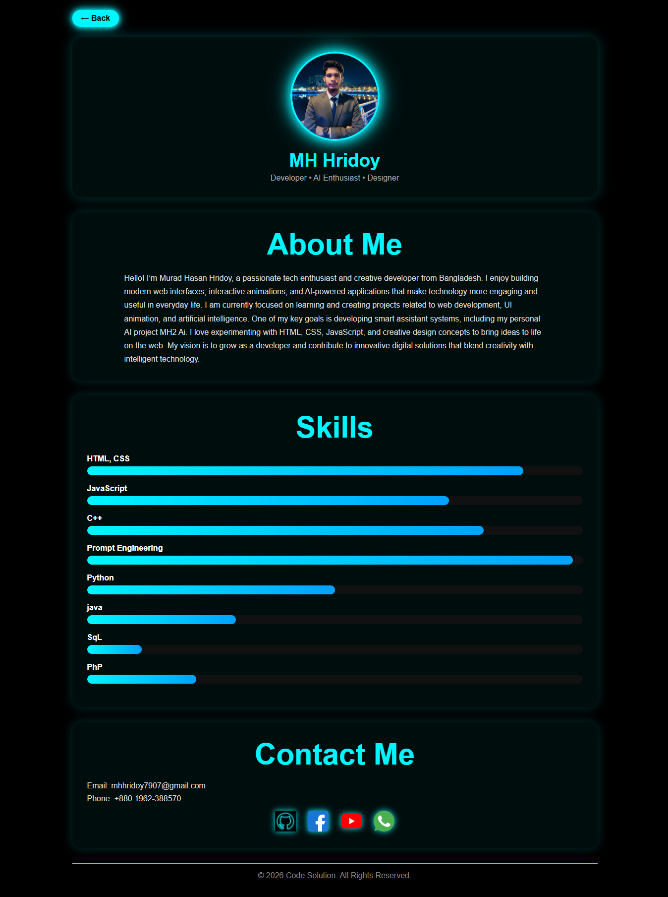
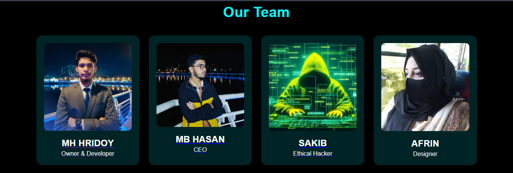

# Modern-3D Website
**Modern-3D Website** is a cutting-edge 3D website project designed to deliver an immersive user experience.  
This project is private. No one may access, download, copy, or use the code without explicit permission from the author.
## Project Preview
### Preview 1

### Preview 2

### Preview 3

### Preview 4

### Preview 5

### Preview 6

## Features
- Fully 3D interactive website
- Modern UI/UX design
- Smooth animations and transitions
- Responsive layout for all devices

---
## Author
 
**Murad Hasan Hridoy** – Developer & Designer  
## License
**All Rights Reserved**  
This code may not be copied, modified, distributed, or used without the express written permission of the author.
